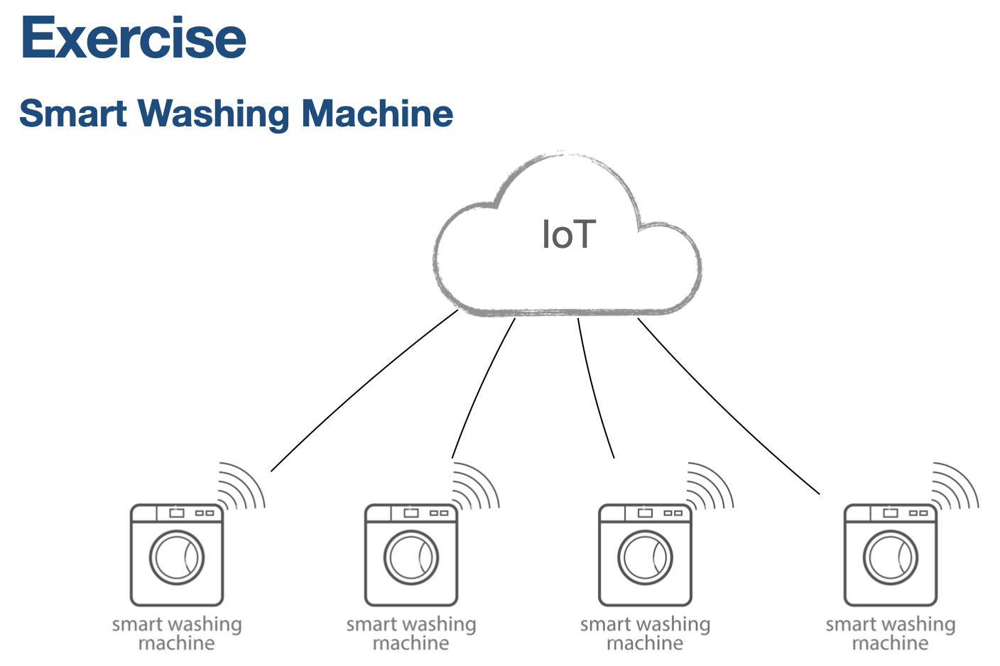

## Get hardware level operations e.g. wash_count
```
Topic: v1cdti/hw/get/6310301011/model-01/SN001
Payload: {
    "action"    : "get",
    "project"   : "6310301011",
    "model"     : "model-01",
    "serial"    : "WSH-SN01",
    "name"      : "wash_count",
    "value"     : "114"
}
```

## Get firmware version
```
Topic: v1cdti/hw/get/6310301011/model-01/SN001
Payload: {
    "action"    : "get",
    "project"   : "6310301011",
    "model"     : "model-01",
    "serial"    : "WSH-SN01",
    "name"      : "firmware_version",
    "value"     : "0FWEG948GG"
}

```

## Get manufacture id  geo-location or location placement
```
Topic: v1cdti/hw/get/6310301011/model-01/SN001
Payload: {
    "action"    : "get",
    "project"   : "6310301011",
    "model"     : "model-01",
    "serial"    : "WSH-SN01",
    "name"      : "manufacture id",
    "value"     : " ID39948590"
}
Topic: v1/hw/get/6310301011/model-01/SN001
Payload: {
    "action"    : "get",
    "project"   : "6310301011",
    "model"     : "model-01",
    "serial"    : "WSH-SN01",
    "name"      : "geo_location",
    "value"     : "13.789470, 100.516397"
}

```

## Set geo-location or location placement
```
Topic: v1cdti/hw/set/6310301011/model-01/SN001
Payload: {
    "action"    : "set",
    "project"   : "6310301011",
    "model"     : "model-01",
    "serial"    : "WSH-SN01",
    "name"      : "geo_location",
    "value"     : "13.789470, 100.516397"
}

```

## Monitor machine sensor
```
Topic: v1cdti/app/monitor/6310301011/model-01/SN001
Payload: {
    "action"    : "monitor",
    "project"   : "6310301011",
    "model"     : "model-01",
    "serial"    : "WSH-SN01",
    "name"      : "proximity",
    "value"     : "100"
}
Topic: v1cdti/app/monitor/6310301011/model-01/SN001
Payload: {
    "action"    : "monitor",
    "project"   : "6310301011",
    "model"     : "model-01",
    "serial"    : "WSH-SN01",
    "name"      : "temperature",
    "value"     : "50"
}
```

## Set machie status to "maint" to indicate this machine need to be maintenance.
```
Topic: v1cdti/app/set/6310301011/model-01/WSH-SN001
Payload: {
    "action"    : "set",
    "project"   : "6310301011",
    "model"     : "model-01",
    "serial"    : "WSH-SN01",
    "name"      : "Machine status",
    "value"     : "maint"
}

```